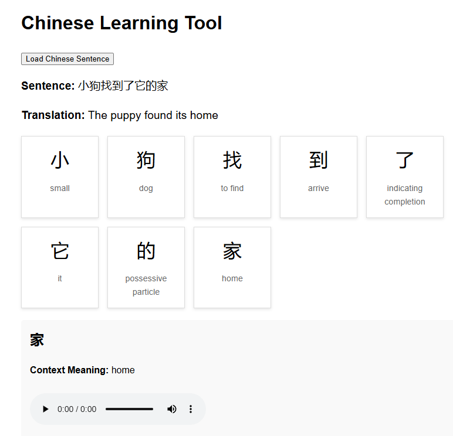

# ChineseAI - Learn Chinese with AI



**ChineseAI** is a simple and effective tool for learning Chinese. It leverages AI to provide:
- Sentence-level translations.
- Context-relevant meanings for each Chinese character.
- Pronunciation audio for each character.

This tool is ideal for learners who want to understand the nuanced meanings of Chinese characters in different contexts.

---

## Features
- **AI-Powered Translations:** Uses OpenAI to create engaging, context-relevant translations.
- **Character Breakdown:** Displays each character with its specific meaning in the sentence.
- **Audio Pronunciation:** Provides audio for individual character pronunciation.

---

## Installation Instructions

### Prerequisites
- [Node.js](https://nodejs.org) installed on your system.

### Steps
1. Clone this repository:
   ```bash
   git clone https://github.com/jimy1974/learn-chinese-ai.git
   cd learn-chinese-ai
Install dependencies:

bash
Copy code
npm install
Create a .env file to store your OpenAI API key:

Create a file named .env in the root folder:
bash
Copy code
touch .env
Open the .env file in a text editor and add the following line, replacing YOUR_OPENAI_API_KEY with your actual OpenAI API key:
env
Copy code
OPENAI_API_KEY=YOUR_OPENAI_API_KEY
Start the server:

bash
Copy code
node server.js
Open your browser and navigate to:

arduino
Copy code
http://localhost:3000
Usage
Click "Load Chinese Sentence" to generate a new sentence.
View the full translation and character-level meanings.
Click on individual characters to hear their pronunciation.
Screenshot


Notes
Ensure your OpenAI API key is valid and active.
The .env file is excluded from the repository for security reasons. Do not share it publicly.
For additional API usage information, visit OpenAI Documentation.


Here’s a README.md file for your project, incorporating the screenshot and providing detailed instructions:

README.md
markdown
Copy code
# ChineseAI - Learn Chinese with AI


**ChineseAI** is a simple and effective tool for learning Chinese. It leverages AI to provide:
- Sentence-level translations.
- Context-relevant meanings for each Chinese character.
- Pronunciation audio for each character.

This tool is ideal for learners who want to understand the nuanced meanings of Chinese characters in different contexts.

---

## Features
- **AI-Powered Translations:** Uses OpenAI to create engaging, context-relevant translations.
- **Character Breakdown:** Displays each character with its specific meaning in the sentence.
- **Audio Pronunciation:** Provides audio for individual character pronunciation.

---

## Installation Instructions

### Prerequisites
- [Node.js](https://nodejs.org) installed on your system.

### Steps
1. Clone this repository:
   ```bash
   git clone https://github.com/jimy1974/learn-chinese-ai.git
   cd learn-chinese-ai
Install dependencies:

bash
Copy code
npm install
Create a .env file to store your OpenAI API key:

Create a file named .env in the root folder:
bash
Copy code
touch .env
Open the .env file in a text editor and add the following line, replacing YOUR_OPENAI_API_KEY with your actual OpenAI API key:
env
Copy code
OPENAI_API_KEY=YOUR_OPENAI_API_KEY
Start the server:

bash
Copy code
node server.js
Open your browser and navigate to:

arduino
Copy code
http://localhost:3000
Usage
Click "Load Chinese Sentence" to generate a new sentence.
View the full translation and character-level meanings.
Click on individual characters to hear their pronunciation.

Notes
Ensure your OpenAI API key is valid and active.
The .env file is excluded from the repository for security reasons. Do not share it publicly.
For additional API usage information, visit OpenAI Documentation.

License
This project is licensed under the MIT License. See the LICENSE file for details.